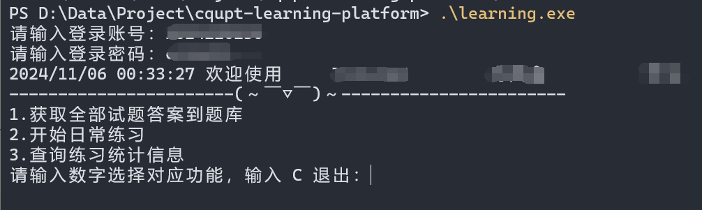
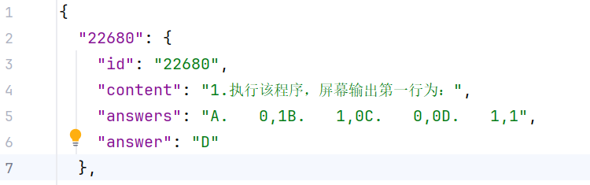
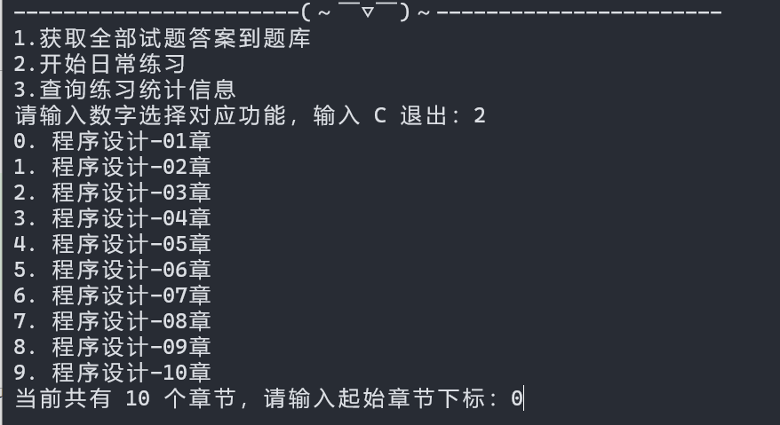
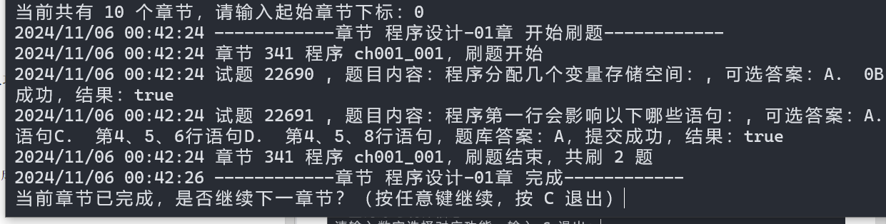
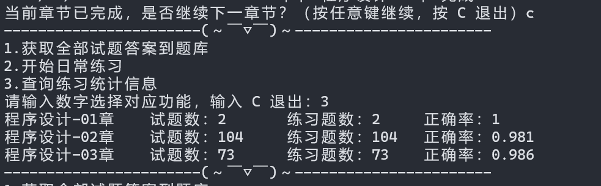

# 重庆邮电大学程序设计学习平台练习程序

使用纯`Go`实现，无需浏览器，编译完成后运行输入**账号和密码**按照提示操作即可。目前支持自定义题库、选择章节练习、练习统计数据展示。如果没有题库，可以选择一获取所有练习题的答案并生成题库文件，假如现有题库不全也没事，练习过程中发现有未收录的题会自动获取正确答案并添加到题库文件中。

## 待实现的功能

- [ ] 考试
- [ ] 自定义正确率

## 如何使用

需要具备`Go`环境且`Go`版本`>= 1.22.2`。首先，`clone`此项目并进入项目根目录

```shell
git clone https://github.com/wnnce/cqupt-learning-platform.git

cd cqupt-learning-platform
```

编译代码为可执行文件，编译完成后会在项目根目录生成一个`learning.exe || learning`可执行文件，这个根据你使用的平台来决定。

```shell
# linux
go build -o learning ./cmd/main.go

# windows
go build -o learning.exe .\cmd\main.go
```

运行二进制文件，输入正确的账号密码，成功登录会进入功能页面并打印欢迎信息。



如果是第一次使用，请先输入`1`生成题库文件。执行完成后，题库文件名为`banks.json`位于`./data`目录下。里面的数据格式如下图所示



题库生成完成后，便可输入`2`进行练习，练习时会要求输入开始练习的章节下标.



当前章节练习完后，会要求选择是否继续练习下一章节，如果是最后一章，则会直接
结束程序。



在功能页面输入`3`可以查询当前练习的统计数据，**数据会在每晚的0点刷新**。



如若感觉练习速度过快或过慢，可以自行调整函数内`time.Sleep()`的时间。

## 自定义题库

如果需要添加自定义的习题，遵循题库文件的数据格式，按照内容添加即可。

## 声明

本项目仅做为个人`Go`练手代码，无任何其它意义，**禁止使用本项目参与或直接添加到任何具有商业性质的活动、代码中**。

如若侵权，**请联系我删除！**